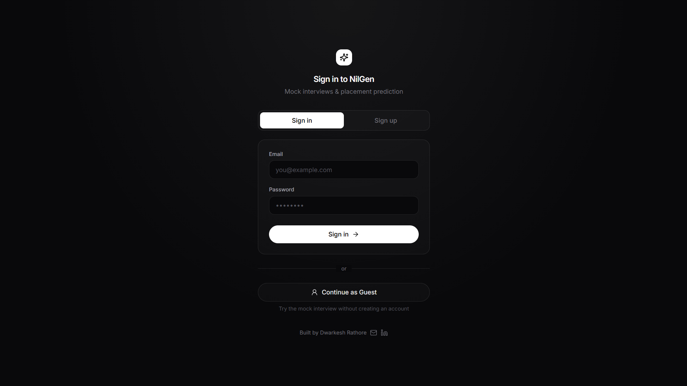
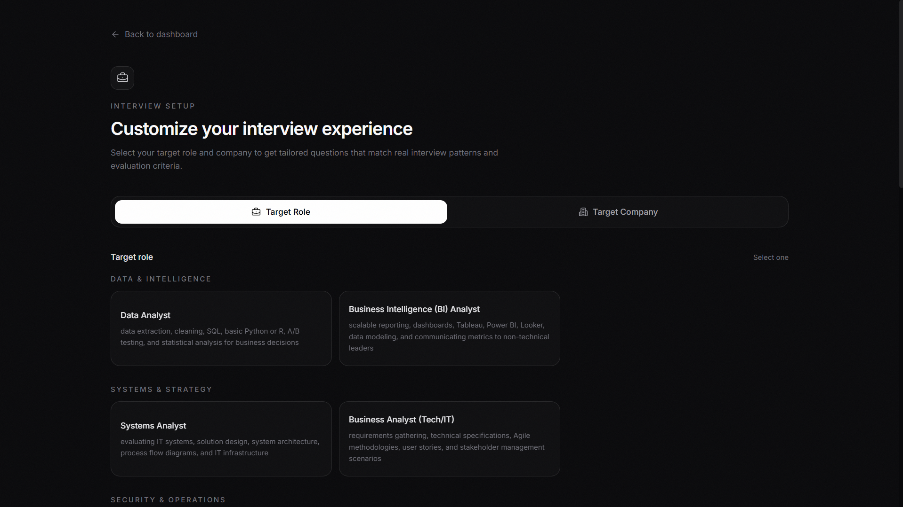
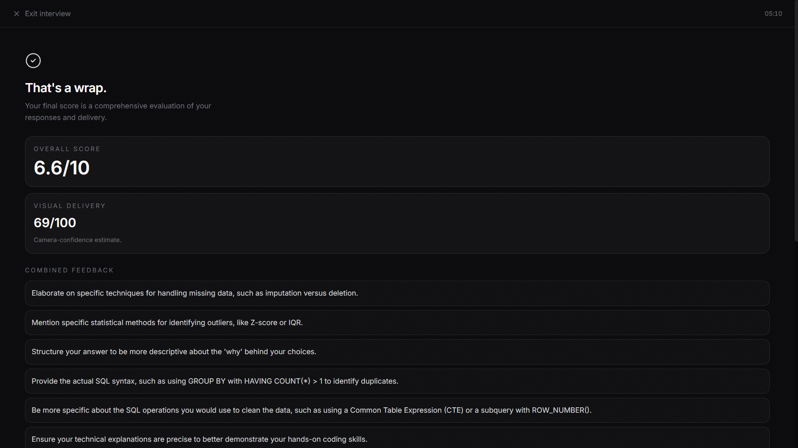
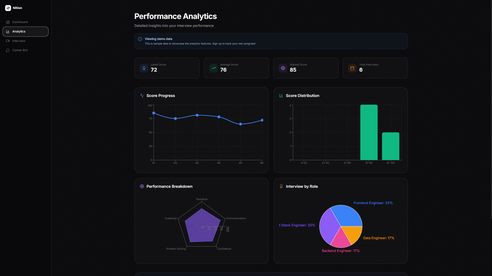

# 🎯 PrepBuddy AI - Mock Interview, Career Chatbot & Placement System

> AI-powered interview preparation platform with realistic mock interviews, real-time feedback, performance analytics, and 24/7 career guidance

[](https://reactjs.org/)
[](https://www.python.org/)
[](https://fastapi.tiangolo.com/)
[](https://opensource.org/licenses/MIT)

---

## 📋 Table of Contents
- [About](#about)
- [Features](#features)
- [Tech Stack](#tech-stack)
- [System Architecture](#system-architecture)
- [Screenshots](#screenshots)
- [Project Structure](#project-structure)
- [Key Features Implementation](#key-features-implementation)
- [Testing](#testing)
- [Contributing](#contributing)
- [License](#license)
- [Contact](#contact)

---

## 🎓 About

**PrepBuddy** is a comprehensive AI-powered mock interview and career preparation system designed to help job seekers excel in technical interviews. The platform combines realistic interview simulations, intelligent feedback analysis, and an AI career chatbot to provide end-to-end placement preparation support.

### Problem Statement
Candidates often struggle with interview preparation due to:
- Lack of realistic practice environments
- No immediate feedback on performance
- Difficulty in identifying improvement areas
- Limited access to personalized career guidance
- Uncertainty about company-specific interview patterns

### Solution
PrepBuddy provides:
- **Realistic mock interviews** with AI-powered voice interviewer
- **Real-time feedback** on confidence, correctness, and communication
- **Personalized analytics** tracking progress over time
- **24/7 AI Career Chatbot** for instant placement guidance and advice
- **Company-specific insights** for targeted preparation

---

## ✨ Features

### 🎤 Realistic Mock Interviews
- **AI Voice Interviewer** - Natural text-to-speech with Indian-English accent
- **2D Animated Avatar** - Lip-synced responses with phoneme-accurate animation
- **Speech Recognition** - Real-time transcription of candidate answers
- **Video Analysis** - Computer vision-based confidence assessment
- **Adaptive Question Flow** - AI generates contextual follow-up questions based on your responses

### 🧠 Intelligent Interview System
- **Context-Aware AI Interviewer** - Maintains full conversation history and adapts questions dynamically
- **Multi-Turn Intelligence** - AI analyzes your answers and asks progressively deeper questions on topics you demonstrate expertise in
- **Company-Specific Interview Patterns**:
  - **Google** - Algorithmic thinking, system design, Googleyness assessment
  - **Amazon** - Behavioral questions using STAR format, Leadership Principles focus
  - **Microsoft** - Technical depth, design patterns, architectural trade-offs
  - **TCS/Infosys/Wipro** - CS fundamentals, aptitude, communication skills
  - **Goldman Sachs/JP Morgan** - Quantitative reasoning, financial domain knowledge
  - **And 5+ more companies** with unique interview styles
- **Dynamic Question Generation** - Questions tailored to your role, skills, and resume
- **Real-Time Answer Evaluation** - Instant scoring with detailed improvement suggestions

### 📊 Intelligent Feedback System
- **Multi-dimensional Analysis**:
  - ✅ **Correctness Score** - NLP-based answer evaluation
  - 😊 **Confidence Score** - Visual cues (eye contact, steadiness, pace)
  - 🎯 **Overall Performance** - Weighted combination of metrics
- **Detailed Breakdown** - Strengths and improvement areas
- **Actionable Insights** - Specific recommendations for improvement

### 📈 Performance Analytics
- **Session History** - Track all interview attempts
- **Visual Charts** - Score trends over time
- **Category Analysis** - Performance across different question types
- **Progress Tracking** - Measure improvement

### 🤖 AI Career Bot
- **24/7 Placement Guidance** - AI-powered conversational chatbot
- **Personalized Advice** - Based on your skills and target role
- **Company-specific Prep** - Insights for top tech companies
- **Academic-aware Recommendations** - Tailored guidance

### 🎨 Modern UI/UX
- **Dark Theme** - Easy on the eyes
- **Responsive Design** - Works on desktop and mobile
- **Smooth Animations** - Framer Motion powered
- **Intuitive Navigation** - Clean, professional interface

### 🔒 Privacy & Security
- **Guest Mode** - Try without signup
- **Secure Authentication** - Token-based auth
- **Local Processing** - Video analysis happens client-side
- **No Data Leakage** - API keys properly secured

---

## 🛠️ Tech Stack

### Frontend
- **React 18** - Modern UI library
- **Vite** - Lightning-fast build tool
- **TailwindCSS** - Utility-first styling
- **Framer Motion** - Smooth animations
- **Lucide Icons** - Beautiful iconography
- **Chart.js** - Data visualization

### Backend
- **Python 3.11** - Core language
- **FastAPI** - High-performance web framework
- **SQLite** - Lightweight database
- **Uvicorn** - ASGI server

### AI/ML Components
- **Large Language Model (LLM)** - Powers intelligent conversation, adaptive questioning, and natural speech
  - **Conversational Intelligence**: Maintains context across multiple turns, generating follow-up questions based on previous answers
  - **Adaptive Interview Flow**: Dynamically adjusts question difficulty and topic based on candidate expertise
  - **Company-Specific Simulation**: Replicates interview styles of Google, Amazon, Microsoft, TCS, and 10+ other companies
  - **High-Availability Architecture**: Multi-provider failover system for uninterrupted service
- **Natural Language Processing (NLP)**:
  - **Scikit-learn** - TF-IDF vectorization and cosine similarity for answer grading
  - **NLTK** - Text preprocessing and tokenization
  - Keyword extraction and semantic matching
- **Computer Vision**:
  - **OpenCV** - Real-time face detection and tracking
  - **TensorFlow** - Deep learning for emotion detection
  - Gaze estimation for eye contact analysis
  - Head movement tracking for steadiness scoring
- **Speech Processing**:
  - **Speech Recognition API** - Real-time audio transcription
  - **Azure Cognitive Services** - Enterprise-grade text-to-speech with neural voices
  - **Rhubarb Lip Sync** - Phoneme extraction for realistic avatar animation
- **Machine Learning Models**:
  - Pre-trained emotion detection model (quantized TFLite)
  - Custom NLP model for technical answer evaluation
  - Confidence scoring algorithms

### DevOps
- **Git** - Version control
- **GitHub Actions** - CI/CD pipeline
- **Environment Variables** - Secure configuration

---

## 🏗️ System Architecture

```
┌─────────────────────────────────────────────────────────────┐
│                         Frontend (React)                     │
│  ┌──────────┐  ┌──────────┐  ┌──────────┐  ┌──────────┐   │
│  │Dashboard │  │Interview │  │Analytics │  │Career Bot│   │
│  └────┬─────┘  └────┬─────┘  └────┬─────┘  └────┬─────┘   │
└───────┼─────────────┼─────────────┼─────────────┼──────────┘
        │             │             │             │
        │             │             │             │
┌───────▼─────────────▼─────────────▼─────────────▼──────────┐
│                    Backend API (FastAPI)                     │
│  ┌──────────┐  ┌──────────┐  ┌──────────┐  ┌──────────┐   │
│  │  Auth    │  │Interview │  │Analytics │  │  Chat    │   │
│  │ Service  │  │  Engine  │  │ Service  │  │  Bot     │   │
│  └────┬─────┘  └────┬─────┘  └────┬─────┘  └────┬─────┘   │
└───────┼─────────────┼─────────────┼─────────────┼──────────┘
        │             │             │             │
        │             │             │             │
┌───────▼─────────────▼─────────────▼─────────────▼──────────┐
│                    AI/ML Layer                               │
│  ┌──────────┐  ┌──────────┐  ┌──────────┐  ┌──────────┐   │
│  │   LLM    │  │  NLP     │  │ Vision   │  │   TTS    │   │
│  │  Model   │  │ Grader   │  │ Analyzer │  │+ Lipsync │   │
│  └──────────┘  └──────────┘  └──────────┘  └──────────┘   │
└─────────────────────────────────────────────────────────────┘
        │             │             │             │
        │             │             │             │
┌───────▼─────────────▼─────────────▼─────────────▼──────────┐
│                    Data Layer                                │
│  ┌──────────┐  ┌──────────┐  ┌──────────┐                  │
│  │ SQLite   │  │  Audio   │  │  Models  │                  │
│  │   DB     │  │  Cache   │  │  Cache   │                  │
│  └──────────┘  └──────────┘  └──────────┘                  │
└─────────────────────────────────────────────────────────────┘
```

---

## 🚀 Installation

### Prerequisites
- **Node.js** 18+ and npm
- **Python** 3.11+
- **Git**
- **LLM API Key** - For AI language model and text-to-speech capabilities

### Step 1: Clone Repository
```bash
git clone https://github.com/dwarkesh-creator/AI-Powered-Mock-Interview-Placement-System.git
cd AI-Powered-Mock-Interview-Placement-System
```

### Step 2: Backend Setup
```bash
cd Backend

# Create virtual environment
python -m venv venv
source venv/bin/activate  # On Windows: venv\Scripts\activate

# Install dependencies
pip install -r requirements.txt

# Create .env file
cp .env.example .env

# Edit .env and add your LLM API key
# API_KEY=your_api_key_here
# MODEL=your_model_name
# TTS_VOICE=preferred_voice
```

### Step 3: Frontend Setup
```bash
cd ../Frontend

# Install dependencies
npm install

# Start development server
npm run dev
```

### Step 4: Start Backend Server
```bash
cd ../Backend

# Activate virtual environment if not already
source venv/bin/activate  # On Windows: venv\Scripts\activate

# Start FastAPI server
python main.py
```

### Step 5: Access Application
- **Frontend**: http://localhost:5173
- **Backend API**: http://localhost:8000
- **API Docs**: http://localhost:8000/docs

---

## 📖 Usage

### 1. Guest Mode (Try Without Signup)
- Click **"Continue as Guest"** on login page
- Access all features with demo data
- Perfect for testing the system

### 2. Create Account
- Click **"Sign Up"** on login page
- Enter email and password
- Start your first interview

### 3. Take a Mock Interview
1. **Setup Interview**
   - Choose target role (e.g., Software Engineer)
   - Select target company (optional)
   - Upload resume (optional)
   - Set number of questions (3-10)

2. **During Interview**
   - Answer questions verbally
   - Recording starts automatically
   - AI avatar speaks questions with lip-sync
   - Your responses are transcribed in real-time

3. **Review Feedback**
   - View overall score
   - Check confidence breakdown
   - Read strengths and improvements
   - See detailed answer analysis

### 4. Track Progress
- Visit **Dashboard** for quick overview
- Check **Analytics** for detailed insights
- View trends over time
- Identify improvement areas

### 5. Get Career Guidance
- Open **Placement Bot**
- Ask about:
  - Interview preparation tips
  - Company-specific questions
  - Resume improvement
  - Technical topics
  - Career advice

---

## 📸 Screenshots

### Login Page

*Clean authentication interface with guest mode option for instant access*

### Dashboard

*Track your interview performance, placement probability, and recent sessions at a glance*

### Mock Interview

*Real-time AI-powered interview with video recording, speech recognition, and animated interviewer*

### Interview Feedback

*Comprehensive performance analysis with scores, confidence metrics, and actionable improvement suggestions*

### Performance Analytics

*Detailed insights with score trends, distribution charts, and role-based breakdowns*

### Career Guidance Bot

*24/7 AI career coach providing personalized placement advice and interview preparation tips*

---

## 📁 Project Structure

```
AI-Powered-Mock-Interview-Placement-System/
├── Backend/
│   ├── main.py                 # FastAPI application
│   ├── answer_grader.py        # NLP answer evaluation
│   ├── confidence.py           # Visual confidence analysis
│   ├── correctness.py          # Answer correctness scoring
│   ├── transcription.py        # Speech-to-text
│   ├── tts_lipsync.py          # Text-to-speech + lip-sync
│   ├── interview.py            # Interview logic
│   ├── requirements.txt        # Python dependencies
│   ├── .env.example            # Environment template
│   └── generated_audio/        # TTS audio cache
│
├── Frontend/
│   ├── src/
│   │   ├── Pages/
│   │   │   ├── Login.jsx
│   │   │   ├── Dashboard.jsx
│   │   │   ├── InterviewSetup.jsx
│   │   │   ├── InterviewRoom.jsx
│   │   │   ├── Analytics.jsx
│   │   │   └── PlacementBot.jsx
│   │   ├── Component/
│   │   │   ├── Sidebar.jsx
│   │   │   ├── Avatar2D.jsx
│   │   │   ├── AnswerRecorder.jsx
│   │   │   └── BuiltBy.jsx
│   │   ├── Layout/
│   │   │   └── AppLayout.jsx
│   │   ├── Context/
│   │   │   └── AuthContext.jsx
│   │   ├── services/
│   │   │   └── interviewOrchestrator.js
│   │   └── App.jsx
│   ├── package.json
│   └── tailwind.config.js
│
├── Ai_Module/
│   ├── NLP/                    # Answer grading module
│   ├── vision/                 # Confidence analysis
│   └── llm/                    # LLM feedback
│
├── Database/
│   └── prepbuddy.db               # SQLite database
│
├── .gitignore
├── README.md
└── LICENSE
```

---

## 🎯 Key Features Implementation

### Answer Grading (NLP)
- Uses TF-IDF vectorization
- Cosine similarity with reference answers
- Keyword matching for technical terms
- Confidence scoring based on answer length and structure

### Confidence Analysis (Computer Vision)
- **Eye Contact**: Face detection + gaze estimation
- **Steadiness**: Head movement tracking
- **Speaking Pace**: Words per minute calculation
- Weighted scoring algorithm

### Text-to-Speech + Lip Sync
- **AI-powered TTS** for natural voice generation
- **Rhubarb Lip Sync** for phoneme extraction
- Real-time mouth shape animation
- Configurable voice (male/female, accent)
- Configurable voice (male/female, accent)

### Career Guidance Bot
- Context-aware responses using advanced LLM
- Conversation history maintenance
- Role-specific recommendations
- CGPA and skills-based advice

---

## 🏭 Production Infrastructure

### Enterprise-Grade Voice Synthesis
- **Azure Cognitive Services TTS** - Professional text-to-speech with natural Indian-English accent (Kunal voice)
- **High throughput** - 20 requests/minute handling concurrent interview sessions
- **Generous free tier** - 500,000 characters/month for cost-effective scaling
- **Premium voice quality** - Neural TTS models for lifelike speech synthesis

### High-Availability Architecture
- **Multi-provider LLM failover** - Automatic fallback system ensures zero downtime during peak usage
- **Intelligent load distribution** - Round-robin request distribution across multiple providers for optimal performance
- **Graceful degradation** - System remains fully operational even during individual provider outages
- **Health monitoring** - Built-in provider health checks and automatic recovery

### Production-Ready Media Handling
- **CORS-compliant audio streaming** - Cross-origin resource sharing properly configured for secure media delivery
- **Web Audio API integration** - Real-time audio analysis powering avatar lip-sync and mouth animations
- **Browser compatibility** - Thoroughly tested across Chrome, Edge, Firefox, and Safari
- **Optimized delivery** - Efficient audio caching and streaming for reduced latency

### User Experience & Security
- **Professional landing page** - Clean onboarding flow with guest access, sign-up, and sign-in options
- **Secure authentication** - Token-based auth with proper session management
- **Guest mode** - Full feature access without account creation for quick demos
- **Responsive design** - Seamless experience across desktop and mobile devices

---

## 🧪 Testing

```bash
# Backend tests
cd Backend
pytest

# Frontend tests (if implemented)
cd Frontend
npm test
```

---

## 🤝 Contributing

Contributions are welcome! Please follow these steps:

1. Fork the repository
2. Create a feature branch (`git checkout -b feature/AmazingFeature`)
3. Commit your changes (`git commit -m 'Add some AmazingFeature'`)
4. Push to the branch (`git push origin feature/AmazingFeature`)
5. Open a Pull Request

---

## 📝 License

This project is licensed under the MIT License - see the [LICENSE](LICENSE) file for details.

---

## 👨‍💻 Author

**Dwarkesh Rathore**

- GitHub: [@dwarkesh-creator](https://github.com/dwarkesh-creator)
- Email: dwarkeshrathore123@gmail.com
- LinkedIn: [Dwarkesh Rathore](https://www.linkedin.com/in/dwarkesh-rathore-50a844297/)

---

## 🙏 Acknowledgments

- **Open Source LLM APIs** - For powerful language models and text-to-speech
- **Rhubarb Lip Sync** - For phoneme extraction technology
- **React Community** - For exceptional UI libraries and tools
- **FastAPI** - For comprehensive documentation and fast web framework
- **Beta Testers** - For valuable feedback during development

---

## 📚 References

- [Modern LLM APIs Documentation](https://ai.google.dev/docs)
- [FastAPI Documentation](https://fastapi.tiangolo.com/)
- [React Documentation](https://react.dev/)
- [Rhubarb Lip Sync](https://github.com/DanielSWolf/rhubarb-lip-sync)
- [OpenCV Documentation](https://docs.opencv.org/)
- [TensorFlow Guides](https://www.tensorflow.org/)

---

## 🐛 Known Issues

- Audio generation may be slow on first request (cold start)
- Vision analysis requires good lighting
- Browser compatibility: Chrome/Edge recommended

---

## 🚀 Future Enhancements

- [ ] 3D avatar with advanced expressions
- [ ] Multi-language support
- [ ] Group interview practice
- [ ] Interview recording download
- [ ] Mobile app version
- [ ] Integration with job portals
- [ ] Peer-to-peer mock interviews
- [ ] Company-specific question banks

---

## 📞 Support

For issues and questions:
- Open an [Issue](https://github.com/dwarkesh-creator/AI-Powered-Mock-Interview-Placement-System/issues)
- Email: dwarkeshrathore123@gmail.com
- LinkedIn: [Dwarkesh Rathore](https://www.linkedin.com/in/dwarkesh-rathore-50a844297/)

---

<div align="center">

**⭐ Star this repo if you find it helpful!**

Made with ❤️ by Dwarkesh Rathore

</div>
